<div align="center">

# DineSight

### Where your friends are eating, what's on the menu tonight,
### and what to put on your plate.

A live dining app for UMass Amherst.

[](https://dine-sight.vercel.app)
[](DineSight-case-study.pdf)
[](https://www.linkedin.com/in/mahad-mushtaq/)

`Next.js 15` · `React 19` · `Supabase` · `Gemini` · `Playwright` · `pgTAP`

</div>

> **About this repository.** This is the case study. The application source is
> private while I decide what DineSight becomes — but everything below describes how
> it is actually built, and the app itself is live.

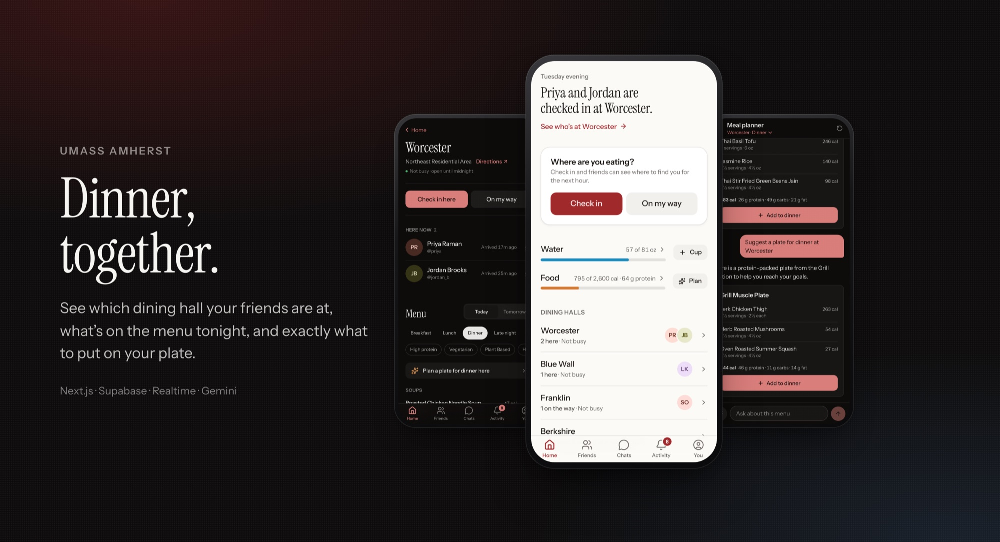

---

## The problem

Seven dining halls. No idea who's there.

## Four things, done properly

| | |
|---|---|
| **Live check-ins** | Check in, or say you're on your way, and friends see where to find you for the next hour. Check-ins expire on their own. |
| **Tonight's menu** | Every dish at every hall with calories, protein, allergens and diet labels, synced from UMass Dining. |
| **Private food tracking** | Log a dish from a menu in one tap, or let the AI planner build a plate. Owner-only, never shared. |
| **Water, together** | An opt-in challenge. Friends see daily totals, never individual logs, and only if they share too. |

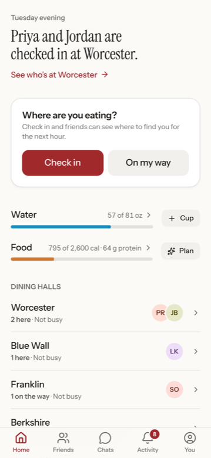 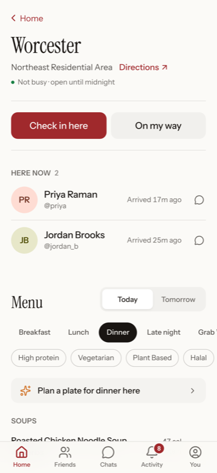 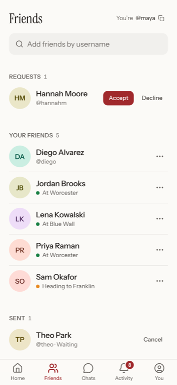 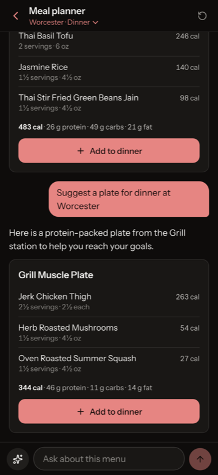

---

## Architecture

One Next.js app, one Postgres, no backend to babysit.

```
EXTERNAL              APPLICATION             DATA AND RULES        PLATFORM
UMass Dining      →   Next.js 15 on Vercel →  Supabase Postgres  →  Auth · Realtime
undocumented          Server components       RLS · column grants   postgres_changes
menus · nutrition     Server actions (writes) triggers              over a socket
hours · busyness      Menu sync, cached       pg_cron retention
                      Prompt building
CLIENT                + validation            EXTERNAL
React 19          →   Service-role key    →   Gemini
Zustand store         never leaves here       Structured JSON only
Optimistic writes                             Never trusted for facts
Installable web app
```

---

## Building on somebody else's undocumented API

UMass Dining's app talks to endpoints that aren't published, versioned or supported.
DineSight treats them as hostile input and never lets them block a page.

- **Reverse-engineered, then documented.** Two endpoints: a location feed with hours
  and busyness thresholds, and an HTML fragment per hall and day whose nutrition
  hides in `data-*` attributes.
- **Parsed defensively.** Malformed dishes are skipped, never thrown. FoodPro's codes
  are cleaned up — `12 OZL` becomes `12 fl oz`, `Brkfst` becomes `Breakfast`.
- **Cached per hall and day.** One request claims the sync through a Postgres
  advisory-style claim; everyone else reads the cache. Today's menu refreshes after
  4 hours, tomorrow's after 12, past days never.
- **Degrades honestly.** If a fetch fails, the previous menu stays. If a sync is
  mid-flight, the client shows a loading state and retries instead of "nothing here".

---

## The database decides. The client only asks.

Every rule lives in Postgres, so a forged request from a modified client fails in the
same place a UI bug would.

```sql
-- 72 database tests assert what is refused, not just what works
SELECT throws_ok(
  $$ UPDATE friendships SET status = 'accepted' $$,
  '42501', NULL,
  'the requester cannot accept their own request'
);

SELECT is(
  (SELECT count(*)::int FROM food_logs),
  0,
  'friends cannot see your food log'
);
```

- **Row-level security everywhere.** Check-ins are visible to accepted friends only;
  food logs and planner conversations to nobody but their owner.
- **Per-column grants.** Clients can insert a check-in but not choose its expiry;
  they can update a display name but never an `email` or a `user_id`.
- **Triggers own the truth.** Timestamps, campus dates and auto-checkout windows are
  stamped server-side. A client can't backdate a food log or a read-receipt.
- **Quotas the client can't reset.** AI usage is counted in a table with no client
  grants at all, claimed through a `SECURITY DEFINER` function that takes no limit
  argument.

Run with `supabase test db` against a real Postgres, as the same roles the app uses.

---

## A meal planner that cannot invent food

A language model is good at composing a plate and bad at arithmetic, and it will
happily invent a dish that sounds plausible. So it never gets the last word on
anything factual.

| | | |
|---|---|---|
| **1 · Server** | Filter the menu | Drop dishes with no nutrition, apply diet and allergy rules, give each dish a short id |
| **2 · Model** | Compose plates | Sees only that menu. Returns ids and servings. Told not to state numbers |
| **3 · Server** | Validate | Unknown ids discarded, servings clamped to ½–3, mixed restaurants dropped |
| **4 · Server** | Compute totals | Calories and macros from UMass data, per serving. Snapshot saved with the plate |
| **5 · Client** | One tap to log | Adds the whole plate, undo in the confirmation, totals update instantly |

If the model returns no usable answer, a plain-code planner builds the plate from the
same menu.

### Grounding beats prompting

**The bug that changed the design.** Asked *"is anything here gluten free?"*, the
model named a soup that UMass lists as containing gluten and wheat. Plates were
already validated; free text wasn't.

*Fix* → allergies and diets mentioned anywhere in the conversation are now applied in
code. Conflicting dishes never reach the model, so it cannot name one. Re-tested
against live Gemini: correct.

**Adversarial checks, run against the real model.** Crash diet ("600 calories a
day"), "ignore your rules", an allergy mentioned mid-chat, a crisis message,
off-topic requests. Result: declined, declined, filtered, fixed crisis response with
988 and campus counseling, declined. *Each is a test, not a hope.*

**Cost and privacy.** Free-tier Gemini shared across everyone using the app, so: 30
requests per person per 12 hours, enforced in Postgres. Prompts carry the menu, the
goal and today's totals — never names or accounts. Conversations delete themselves
after 12 hours.

---

## Instant, then correct

Every write shows its result before the network answers, and reconciles when it does.

- **Optimistic with a version guard.** Each check-in mutation takes a version; a slow
  response can't overwrite a newer action, and a failed one rolls back with an
  explanation.
- **Realtime, authenticated.** The socket is authenticated *before* subscribing —
  otherwise it silently joins anonymous and row-level security filters everything away.
- **Offline is a state, not a crash.** Going offline rolls the action back and says
  so; reconnecting catches up with one refetch.
- **Sessions end everywhere.** Signing out in one tab sends the others back to
  sign-in, returning to the page they were on.
- **Midnight is handled.** Totals roll over on the campus calendar, not the device's,
  including across daylight saving.

---

## Product judgement: calorie tracking, built carefully

Tracking food among college students can feed disordered eating. These are product
decisions, enforced in code.

- Off by default, with a "just track" mode that has no targets at all.
- **A floor in the database.** No target below 1,200 kcal can be saved, by anyone,
  ever — not a client-side check.
- Nothing sensitive leaves the phone. The calculator's height, weight and age stay on
  the device; only the resulting targets are stored.
- Neutral language. Passing a target reads "Target reached", not a red warning.
- **Private by construction.** No friend policy exists on food tables, so there is no
  setting that could leak them.

Water is the opposite call: opt-in on both sides, shares daily totals only, and shows
nothing until you share too.

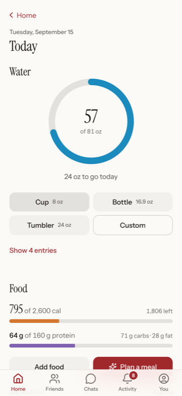  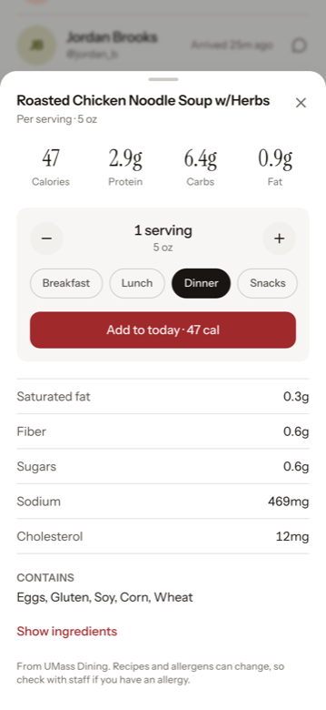 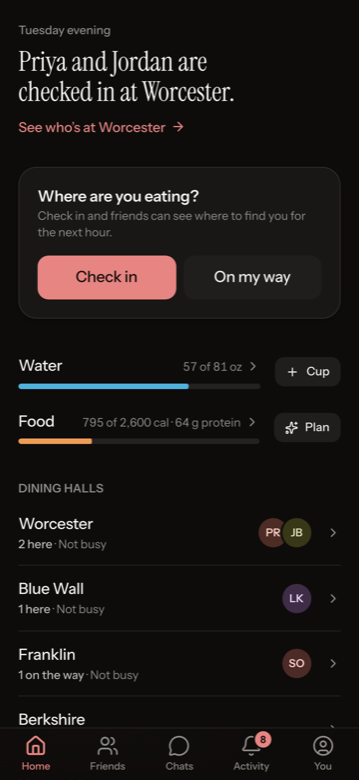

---

## 416 tests, weighted where the risk is

| Count | Kind | |
|---|---|---|
| **288** | Unit and component | Vitest and Testing Library: parsing, portion maths, target calculator, prompt building, response validation, React screens |
| **72** | Database | pgTAP against real Postgres, as the real roles. Most assert that something is *refused* |
| **56** | End to end | Playwright against a real Supabase stack, on desktop Chrome, Pixel 7 and iPhone WebKit |
| **0** | Accessibility violations | axe-core on every screen, light and dark, at 320px and up — part of the suite, not a one-off audit |

End-to-end tests sign up real users against a local Supabase, exercise realtime
between two browser contexts, and run the AI path with the model mocked, so a rate
limit can never fail the build. The live model is exercised separately, by hand,
against a scripted set of adversarial prompts.

**A test-infrastructure bug worth naming.** Reload-after-save tests were flaky, worst
on WebKit. The cause: Playwright's `waitForLoadState("networkidle")` resolves
immediately on an already-loaded page, so reloads were cancelling the save they were
meant to wait for. Replaced with an explicit wait for the server action's response;
two full suite runs, clean.

---

## Found before users did

A dedicated QA pass before launch, then again before each feature merge. Every fix
below ships with a test.

| Bug | Fix |
|---|---|
| Blue Wall merged nine restaurants into one menu — "Add-ons" held 81 dishes, "Fountain Drink" appeared seven times | `restaurant` stored as its own column, browsed restaurant-first, the way UMass Dining lists it |
| Confirmation emails failed on a second device — "link expired" despite a confirmed account | The callback detects the missing PKCE verifier and shows "You're all set" |
| Typical iPhone photos rejected as avatars — a 2 MB limit checked against the original file, but phone photos are 3–5 MB | Resize to a 512px JPEG in the browser first, which also converts HEIC on Safari |
| Sign-in flashed "couldn't reach DineSight" — Next.js signals redirects by throwing, and the catch block treated that as a network failure | Rethrow control-flow errors before handling real ones |
| Signing out in one tab left the others half-broken | Tabs re-check the session on focus and return to sign-in, remembering the page you were on |

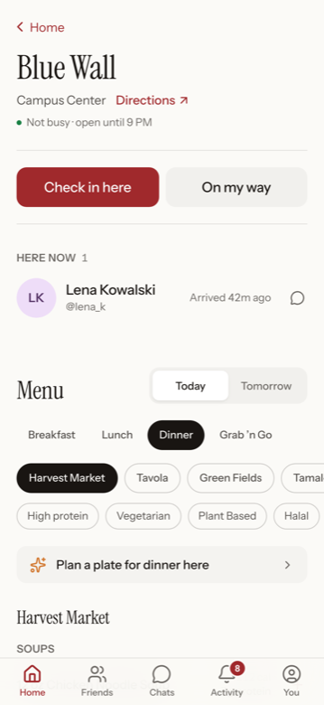 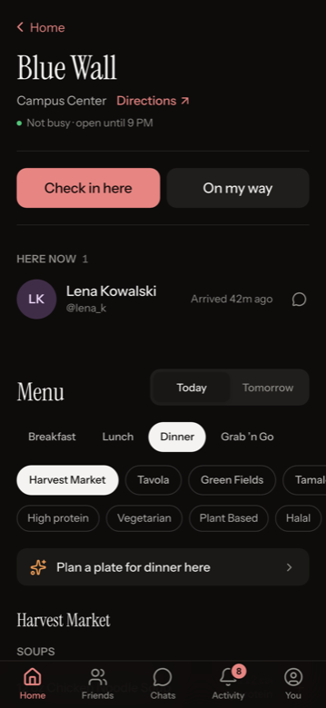

---

## Craft

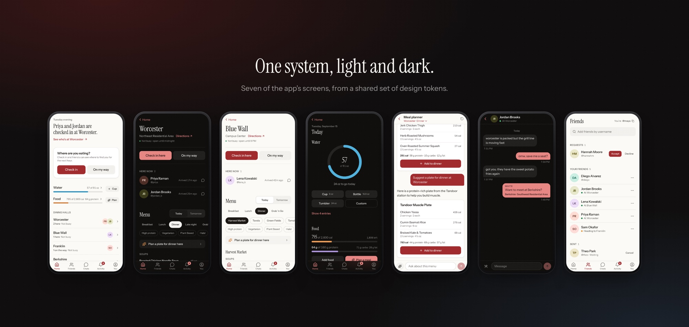

- **Tokens, not values.** Colour, type scale, radii and motion live in one place;
  light and dark ship together.
- **Built for a dining hall doorway.** Thumb-height controls, instant feedback, and
  an undo on everything that writes.
- **Details that only show on a phone.** Safe-area padding, no double-tap zoom,
  pressed states on rows, auto-capitalised names, a translucent status bar when
  installed.
- Contrast held to AA in both themes, including the two tokens that failed the first
  audit.
- Link previews and an app icon generated at the edge, so a texted link looks like a
  product.

---

## Stack and operations

| | |
|---|---|
| **Frontend** | Next.js 15 App Router · React 19 · TypeScript · Tailwind CSS 4 · Base UI · Zustand |
| **Backend** | Supabase Postgres · server actions · SQL migrations as the source of truth |
| **AI** | Gemini with structured output, schema validation and a deterministic fallback |
| **Testing** | Vitest · Testing Library · pgTAP · Playwright · axe-core |
| **Delivery** | Vercel; Supabase's GitHub integration runs migrations on merge |

- **Migrations are the schema.** Twelve numbered files; nothing changed by hand in a
  dashboard.
- **Secrets stay server-side.** The service-role key is used only by the menu sync,
  never shipped to a browser.
- **Retention runs itself.** An hourly `pg_cron` job deletes planner conversations
  older than 12 hours; row-level security hides them immediately.
- **Documented as it was built.** A 21-chapter engineering journal records decisions,
  trade-offs and a ledger of every bug.

---

## What's next

Shipped software has a to-do list. These are mine, in priority order, with the
reasoning.

1. **Own email delivery.** Supabase's built-in sender only reaches project members
   and rate-limits hard.
2. **Account deletion and password change.** Expected in any real product, and a
   prerequisite for putting this in front of strangers rather than friends.
3. **Weekly trends.** Daily totals encourage fixation; a seven-day average is both
   healthier and more useful, and the data is already stored.
4. **Permission from UMass Dining.** The menu endpoints are public but undocumented.
   Anything beyond a campus project needs a conversation first.
5. **Push notifications.** "Two friends just checked in at Worcester" is the app's
   best moment, and it currently only exists if you're looking.
6. **A native shell.** Only needed for Apple Health and reliable notifications on
   iOS — not before.

---

<div align="center">

Built, tested and documented end to end.

**[Try it live](https://dine-sight.vercel.app)** · **[Read the full case study](DineSight-case-study.pdf)** 

**[mahadmushtaq21@gmail.com](mailto:mahadmushtaq21@gmail.com)** · **[LinkedIn](https://www.linkedin.com/in/mahad-mushtaq/)** · **[More work](https://github.com/mahad1921)**

<sub>Menus, nutrition and busyness data belong to UMass Dining.
Screenshots use demo accounts, not real students.</sub>

</div>
